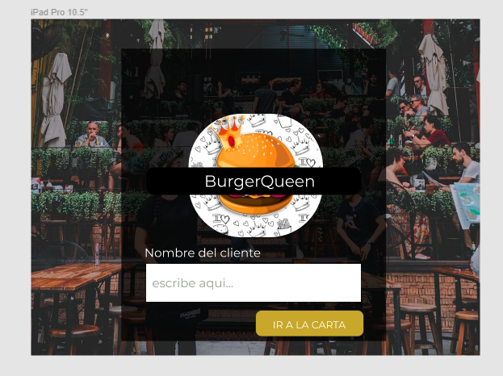
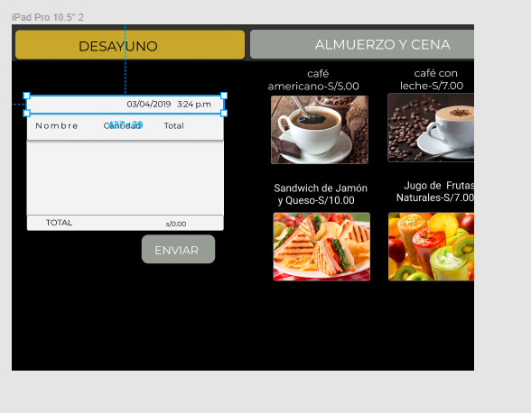
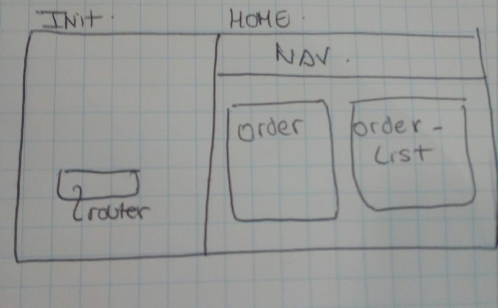

# Burger Queen

## Preámbulo

 [Angular](https://angular.io/)
es uno de los _frameworks_ de JavaScript más utilizados por
lxs desarrolladorxs alrededor del mundo, y hay una razón para eso.
En el contexto del navegador, [_mantener la interfaz sincronizada con el estado
es difícil_](https://medium.com/dailyjs/the-deepest-reason-why-modern-javascript-frameworks-exist-933b86ebc445).
Al elegir un _framework_ para nuestra interfaz, nos apoyamos en una
serie de convenciones e implementaciones _probadas_ y _documentadas_ para
resolver un problema común a toda interfaz web. Esto nos permite concentrarnos
mejor (dedicar más tiempo) en las características _específicas_ de
nuestra aplicación.

## Resumen del proyecto

Un pequeño restaurante de hamburguesas, que está creciendo, necesita una
interfaz en la que puedan tomar pedidos usando una _tablet_, y enviarlos
a la cocina para que se preparen ordenada y eficientemente (a través de un
  _backend_ del que nos darán detalles más adelante).

Esta es la información que tenemos del cliente:

> Somos **Burguer Queen**, una cadena de comida 24hrs.
>
> Nuestra propuesta de servicio 24hrs ha tenido muy buena acogida y, para
> seguir creciendo, necesitamos un sistema que nos ayude a tomar los pedidos de
> nuestros clientes.
>
> Tenemos 2 menús: uno muy sencillo para el desayuno:
>
> 
>
> Y otro menú para el resto del día:
>
>


## Objetivos de aprendizaje

1. El objetivo principal de es aprender a construir una _interfaz web_ usando
el _framework_ elegido (React o Angular). Todos estos frameworks de
Front-end atacan el mismo problema: **cómo mantener la interfaz y el estado
sincronizados**. Así que esta experiencia espera familiarizarte con el concepto
de _estado de pantalla_, y cómo cada cambio sobre el estado se va a
ir reflejando en la interfaz (por ejemplo, cada vez que agregamos un _producto_
a un _pedido_, la interfaz debe actualizar la lista del pedido y el total).

2. Como objetivo secundario, deberás seguir las recomendaciones para PWAs
(_Progressive Web Apps_), lo cual incluye conceptos como **offline**. Para
guiarte con respecto a este tema te recomendamos usar [Lighthouse](https://developers.google.com/web/tools/lighthouse/?hl=es),
que es una herramienta de Google que nos ayuda a asegurar que nuestras web apps
sigan "buenas prácticas". De hecho, usaremos Lighthouse a la hora de evaluar el
proyecto.

3. Finalmente, la interfaz debe estar diseñada específicamente para correr en
**tablets**.

Tópicos: _react_, _angular_, _pwa_, _offline-first_, _service-worker_.


---------------------
#### [Historia de usuario 1] Mesero/a debe poder tomar pedido de cliente
Yo como meserx quiero tomar el pedido de un cliente para no depender de mi mala
memoria, para saber cuánto cobrar, y enviarlo a la cocina para evitar errores y
que se puedan ir preparando en orden.
## Prototipo Figma





 ## estructura con componente
 


##### Criterios de aceptación
Lo que debe ocurrir para que se satisfagan las necesidades del usuario)
  * Anotar nombre de cliente.
  * Agregar productos al pedido.
  * Eliminar productos.
  * Ver resumen y el total de la compra.
  * Enviar pedido a cocina (guardar en alguna base de datos).
  * Se ve y funciona bien en una _tablet_


## Primeros pasos

1. El primer paso de este proyecto debe ser convertir el menú descrito por el
cliente en una estructura que podamos poner en un archivo JSON para después
_pintar_ en la pantalla

2. Haz un _fork_ de este repo (en GitHub).

3. Clona tu _fork_ en tu computadora:

   ```sh
   git clone git@github.com:<tu-usuario-de-github>/<cohortid>-burger-queen.git
   cd <cohortid>-burger-queen
   ```

4. Crea una rama a partir de `master` para empezar a trabajar. Por ejemplo:

   ```sh
   git checkout -b develop
   ```

5. Crear proyecto en [Firebase](https://firebase.google.com/)

6. Habilitar Firestore (_comenzar en modo bloqueado_) en sección de "Bases de
   Datos" de [Firebase console](https://console.firebase.google.com/).

7. Instalar utilidad de línea de comando de Firebase:

   ```sh
   npm i -g firebase-tools
   ```
8. Ahora usa el siguiente comando para acceder con tu cuenta de Google:

   ```sh
   firebase login
   ```

9. Agregamos entorno de producción para desplegar:

   ```sh
   firebase use --add
   ```
  Elige el proyecto de Firebase y un alias:

  


10. Instalar dependencias de cloud functions:

   ```sh
   # usando yarn
   cd functions && yarn && cd ..
   # alternativamente, usando npm
   cd functions && npm install && cd ..
   ```

11. Desplegar:

   ```sh
   firebase deploy
   ```

12. Llegado a este punto ya puedes comenzar con el _front-end_ :wink:

***

## Pistas / Tips


### Herramientas

* [npm-scripts](https://docs.npmjs.com/misc/scripts)
* [Babel](https://babeljs.io/)
* [webpack](https://webpack.js.org/)

### PWA

* [Tu primera Progressive Web App - Google developers](https://developers.google.com/web/fundamentals/codelabs/your-first-pwapp/?hl=es)
* [Progressive Web Apps - codigofacilito.com](https://codigofacilito.com/articulos/progressive-apps)
* [offlinefirst.org](http://offlinefirst.org/)
* [Usando Service Workers - MDN](https://developer.mozilla.org/es/docs/Web/API/Service_Worker_API/Using_Service_Workers)
* [Cómo habilitar datos sin conexión - Firebase Docs](https://firebase.google.com/docs/firestore/manage-data/enable-offline?hl=es-419)

### Serverless

* [Qué es eso de serverless? - @PamRucinque en Medium](https://medium.com/@PamRucinque/qu%C3%A9-es-eso-de-serverless-f4f6c8949b87)
* [Qué es Serverless? | FooBar - YouTube](https://www.youtube.com/watch?v=_SYHUpLi-2U)
* [Firebase](https://firebase.google.com/)
* [Serverless Architectures - Martin Fowler](https://www.martinfowler.com/articles/serverless.html)

### Cloud functions

* [Cloud functions - Firebase Docs](https://firebase.google.com/docs/functions/?hl=es-419)
